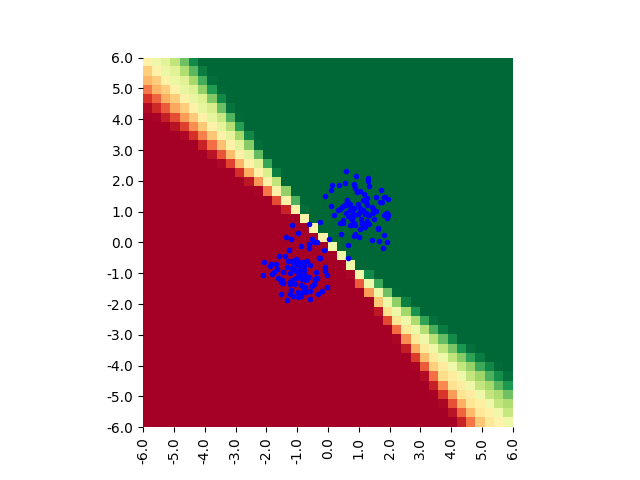

# Implementation of "Bayesian Learning via Stochastic Gradient Langevin Dynamics"

This is not the original implementation.

[Bayesian Learning via Stochastic Gradient Langevin Dynamics](https://www.ics.uci.edu/~welling/publications/papers/stoclangevin_v6.pdf)

## Environment
 * Python 3.6.2
 * TensorFlow 1.10
 * See pip.freeze for details

## Usage
### Logistic regression

```sh
python main.py --hparams params/SGLD_LR
```

## Results
### Logistic regression



## Author

[Ryo Kamoi](https://ryokamoi.github.io/)
